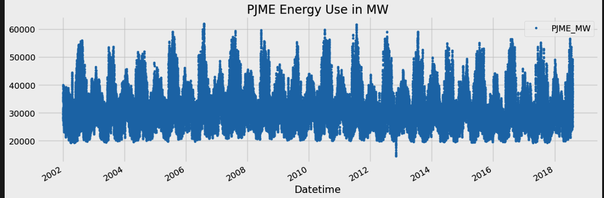
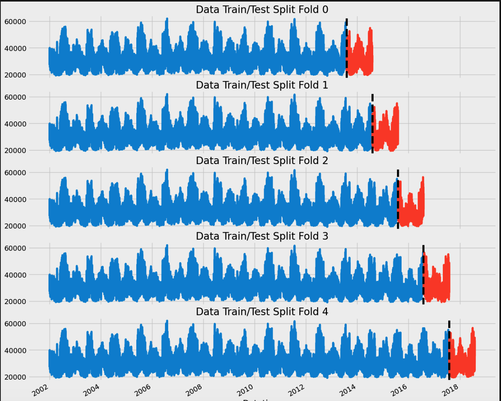
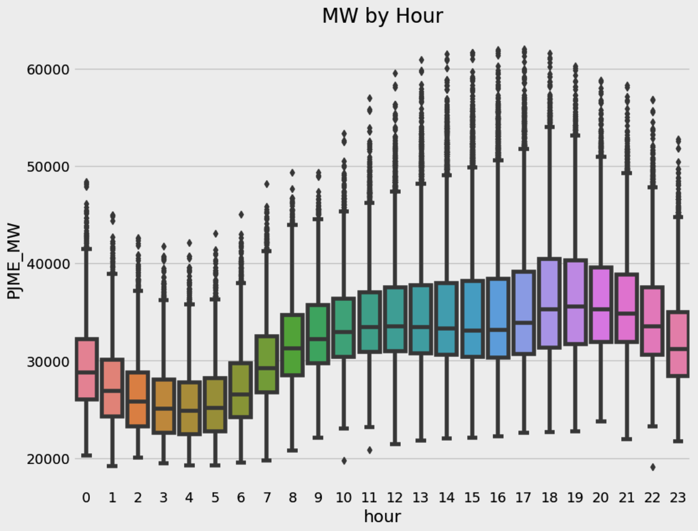
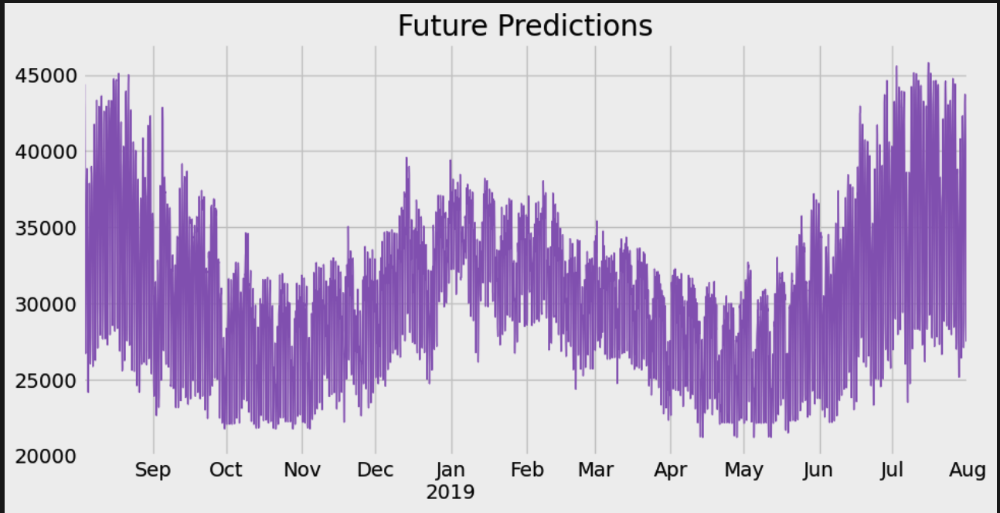

# Time Series Forecasting for Energy Consumption

## Introduction

This project focuses on time series forecasting for energy consumption, aiming to predict future energy demand using various forecasting techniques. Accurate forecasts are crucial for efficient energy management and planning.

## Project Structure

The project is organized into the following sections:

1. **Introduction to Time Series Forecasting**:
   - Explanation of the importance and objectives of forecasting energy consumption.

2. **Data Import and Preparation**:
   - Importing necessary libraries.
   - Loading and cleaning energy consumption data.

3. **Exploratory Data Analysis (EDA)**:
   - Descriptive statistics and visualization of the time series data.

   

4. **Time Series Forecasting Methods**:
   - Implementing ARIMA (AutoRegressive Integrated Moving Average).
   - SARIMA (Seasonal ARIMA).
   - Prophet model by Facebook.

5. **Model Evaluation and Results**:
   - Performance metrics for different models.
   - Visualization of forecasted vs actual values.

   

6. **Conclusion**:
      

## Getting Started

### Prerequisites

Ensure you have the following libraries installed:

- `pandas`
- `numpy`
- `matplotlib`
- `statsmodels`
- `prophet`

You can install these libraries using pip:

\`\`\`bash
pip install pandas numpy matplotlib statsmodels prophet
\`\`\`

### Running the Project

1. Clone the repository:
   \`\`\`bash
   git clone (https://github.com/sovitnayak123/Time_series_forecasting)](https://github.com/sovitnayak123/Time_series_forecasting)
   cd time-series-forecasting-energy-consumption
   \`\`\`

2. Open the Jupyter notebook:
   \`\`\`bash
   jupyter notebook Time_series_Forecasting_for_Energy_consumption.ipynb
   \`\`\`

3. Follow the instructions within the notebook to execute the cells and reproduce the analysis.

## Results

The project provides insights into future energy consumption using different forecasting techniques. Key findings include:

- Performance of various models in predicting energy consumption.
- Comparison of forecasted vs actual values.

## Conclusion

This project demonstrates the application of time series forecasting techniques to predict energy consumption. Future work could explore additional models and incorporate more complex patterns in the data.

## Author

- **Sovit Nayak**

## License

This project is licensed under the MIT License - see the [LICENSE](LICENSE) file for details.

